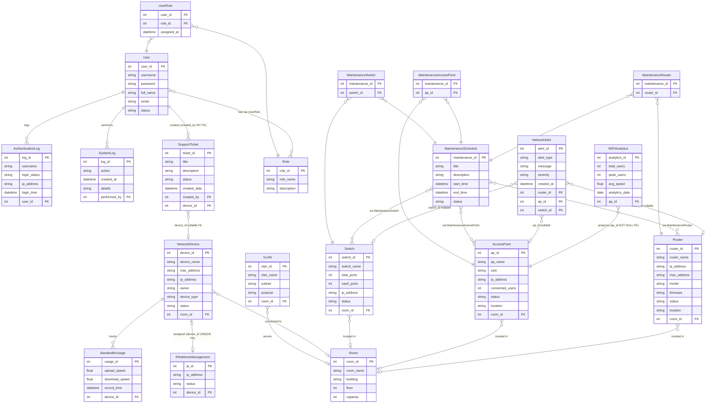

# ERD and Database Design — 20 Tables (SQL Server)

> **Nguồn sự thật:** File này được đồng bộ theo `Network2.sql`.
> Database: **SQL Server** (không phải MySQL).
> Tên database: `network_simulation_db` (file SQL gốc dùng `network_simulation_db3` — cần đổi trước khi chạy chung).
> Tổng: **20 bảng** — 16 bảng chính + 4 bảng junction.

---

## 1. ERD Diagram (Mermaid)



---

## 2. Các điểm sai lệch đã sửa so với phiên bản cũ

| Vấn đề cũ | Đã sửa thành |
|---|---|
| `User` có field `role VARCHAR(30)` | Đã xóa — role quản lý qua `UserRole` junction table |
| Schema dùng MySQL (`AUTO_INCREMENT`, `CURRENT_TIMESTAMP`, `TEXT`) | Schema dùng SQL Server (`IDENTITY(1,1)`, `GETDATE()`, `NVARCHAR`, `NVARCHAR(MAX)`) |
| `IPAddressManagement.assigned_to VARCHAR` | Đổi thành `device_id INT UNIQUE FK → NetworkDevice` |
| `BandwidthUsage.device_name VARCHAR` | Đổi thành `device_id INT NOT NULL FK → NetworkDevice` |
| `SupportTicket.created_by VARCHAR` | Đổi thành `created_by INT NOT NULL FK → [User]` |
| `SystemLog.performed_by VARCHAR` | Đổi thành `performed_by INT FK → [User]` |
| `AuthenticationLog` không có `user_id` | Thêm `user_id INT nullable FK → [User]` (null khi login thất bại) |
| `WiFiAnalytics` không có `ap_id` | Thêm `ap_id INT NOT NULL FK → AccessPoint` |
| `NetworkAlert` không có FK thiết bị | Thêm `router_id`, `ap_id`, `switch_id` (đều nullable) |
| Thiếu 4 bảng junction | Thêm `UserRole`, `MaintenanceRouter`, `MaintenanceAccessPoint`, `MaintenanceSwitch` |
| Sample data dùng MySQL syntax | Sample data đã dùng T-SQL (xem `Network2.sql`) |

---

## 3. Schema SQL Server (tham khảo từ Network2.sql)

Script đầy đủ xem trong `Network2.sql`. Các lưu ý quan trọng khi viết DAO:

```sql
-- Bảng đặc biệt phải viết trong ngoặc vuông
SELECT * FROM [User]
SELECT * FROM [Switch]

-- Nullable FK: dùng rs.wasNull() sau rs.getInt()
int roomId = rs.getInt("room_id");
router.setRoomId(rs.wasNull() ? null : roomId);

-- Set null cho nullable FK
if (router.getRoomId() == null) {
    ps.setNull(8, Types.INTEGER);
} else {
    ps.setInt(8, router.getRoomId());
}
```

---

## 4. Status Values (theo Network2.sql)

| Table | Status Values |
|---|---|
| `[User]` | `ACTIVE`, `INACTIVE` |
| `Router` | `ONLINE`, `OFFLINE`, `MAINTENANCE` |
| `AccessPoint` | `ONLINE`, `OFFLINE` |
| `[Switch]` | `ONLINE`, `OFFLINE`, `MAINTENANCE` |
| `NetworkDevice` | `ALLOWED`, `BLOCKED` |
| `SupportTicket` | `OPEN`, `IN_PROGRESS`, `RESOLVED`, `CLOSED` |
| `MaintenanceSchedule` | `PLANNED`, `IN_PROGRESS`, `COMPLETED` |
| `IPAddressManagement` | `AVAILABLE`, `ASSIGNED`, `RESERVED` |
| `AuthenticationLog` | `SUCCESS`, `FAILED` |
| `NetworkAlert` | severity: `INFO`, `WARNING`, `CRITICAL` |

---

## 5. Relationship Explanations (đã sửa)

| Relationship | Type | Description |
|---|---|---|
| User ↔ Role | Many-to-Many | Qua `UserRole` junction table — không có `role` field trực tiếp trên `User` |
| Router → Room | Many-to-One | Nullable FK — router có thể không gắn room |
| AccessPoint → Room | Many-to-One | Nullable FK |
| Switch → Room | Many-to-One | Nullable FK |
| NetworkDevice → Room | Many-to-One | Nullable FK |
| VLAN → Room | Many-to-One | Nullable FK |
| NetworkDevice → BandwidthUsage | One-to-Many | `device_id NOT NULL FK` |
| NetworkDevice → IPAddressManagement | One-to-One | `device_id UNIQUE nullable FK` |
| AccessPoint → WiFiAnalytics | One-to-Many | `ap_id NOT NULL FK` |
| NetworkAlert → Router/AP/Switch | Many-to-One (optional) | Ba FK đều nullable — một alert chỉ liên quan một loại thiết bị |
| SupportTicket → User | Many-to-One | `created_by INT NOT NULL FK` |
| SupportTicket → NetworkDevice | Many-to-One | `device_id nullable FK` |
| AuthenticationLog → User | Many-to-One | `user_id nullable FK` — null khi username không tồn tại |
| SystemLog → User | Many-to-One | `performed_by INT nullable FK` |
| MaintenanceSchedule ↔ Router/AP/Switch | Many-to-Many | Qua 3 junction tables |

---

## 6. Indexing Strategy

| Table | Index | Reason |
|---|---|---|
| `[User]` | `username` (UNIQUE) | Fast login lookup |
| `NetworkDevice` | `mac_address` (UNIQUE) | Fast MAC-based device search |
| `Router` | `ip_address` (UNIQUE), `mac_address` (UNIQUE) | Prevent duplicate |
| `AccessPoint` | `ip_address` (UNIQUE) | Prevent duplicate |
| `[Switch]` | `ip_address` (UNIQUE) | Prevent duplicate |
| `IPAddressManagement` | `ip_address` (UNIQUE), `device_id` (UNIQUE) | Prevent duplicate IP + one device one IP |
| `BandwidthUsage` | `record_time` | Fast date-range queries |
| `AuthenticationLog` | `login_time`, `username` | Fast log search |
| `SystemLog` | `created_at`, `performed_by` | Fast audit trail search |
| `NetworkAlert` | `created_at`, `severity` | Fast alert filtering |

---

## 7. Table Creation Order (FK-safe)

```text
1. Role
2. [User]
3. UserRole          ← FK: User, Role
4. Room
5. Router            ← FK: Room
6. AccessPoint       ← FK: Room
7. [Switch]          ← FK: Room
8. NetworkDevice     ← FK: Room
9. VLAN              ← FK: Room
10. IPAddressManagement  ← FK: NetworkDevice
11. BandwidthUsage   ← FK: NetworkDevice
12. WiFiAnalytics    ← FK: AccessPoint
13. NetworkAlert     ← FK: Router, AccessPoint, Switch
14. SupportTicket    ← FK: User, NetworkDevice
15. MaintenanceSchedule
16. MaintenanceRouter       ← FK: MaintenanceSchedule, Router
17. MaintenanceAccessPoint  ← FK: MaintenanceSchedule, AccessPoint
18. MaintenanceSwitch       ← FK: MaintenanceSchedule, Switch
19. AuthenticationLog ← FK: User
20. SystemLog         ← FK: User
```

---

## 8. Related Documents

- `Network2.sql` — Nguồn sự thật cho schema (SQL Server T-SQL)
- `03_team_assignment_updated.md` — Who owns which tables
- `07_coding_guide.md` — How to implement DAO for these tables
