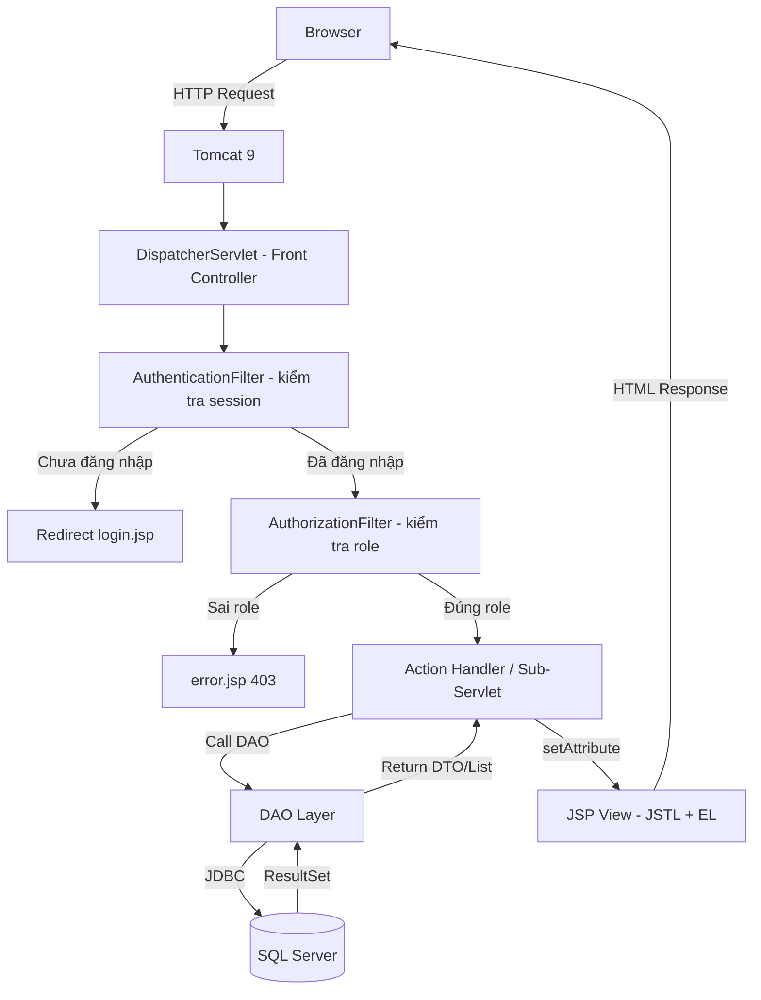
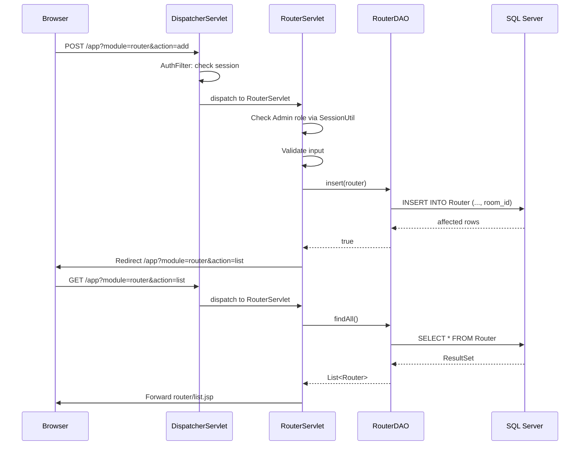

# System Architecture and Folder Structure

> **Đồng bộ với:** `Network2.sql` (SQL Server, 20 bảng).
> **Kiến trúc:** MVC-V2 với FrontController — bắt buộc theo đề bài PDF (2.0 điểm).

---

## 1. Architecture Overview (MVC-V2 với FrontController)

Đề bài yêu cầu **FrontController (DispatcherServlet)** điều phối toàn bộ request. Không dùng mô hình mỗi model một URL riêng mà không có front controller.



### Layer Responsibilities

| Layer | Technology | Responsibility |
|---|---|---|
| Presentation | JSP + JSTL + EL + Bootstrap 5 | Render HTML, nhận form input — không có scriptlet lớn |
| FrontController | `DispatcherServlet` (`javax.servlet`) | Nhận toàn bộ request, điều phối sang sub-servlet/action |
| Sub-Controller | Các Servlet con | Xử lý action cụ thể, validate, gọi DAO |
| Filter | `AuthenticationFilter`, `AuthorizationFilter`, `EncodingFilter` | Kiểm tra session, phân quyền, UTF-8 |
| Data Access | DAO classes | SQL Server queries via JDBC — không có SQL trong Servlet/JSP |
| Model | DTO/JavaBean | Data carrier giữa các layer |
| Utility | Helper classes | `DBContext`, `SessionUtil`, `PasswordUtil` |

> **Lưu ý quan trọng:** DAO/Service layer phải riêng biệt. Không viết SQL hoặc business logic trong Servlet hoặc JSP — đây là yêu cầu bắt buộc của đề bài.

---

## 2. Project Folder Structure

```text
NetworkSimulationManagement/
|-- Web Pages/
|   |-- index.jsp
|   |-- login.jsp
|   |-- dashboard.jsp
|   |-- error.jsp
|   |-- WEB-INF/
|   |   `-- web.xml
|   |-- assets/
|   |   |-- css/style.css
|   |   |-- js/main.js
|   |   `-- images/logo.png
|   |-- user/list.jsp
|   |-- user/form.jsp
|   |-- role/list.jsp
|   |-- role/form.jsp
|   |-- router/list.jsp
|   |-- router/form.jsp
|   |-- accesspoint/list.jsp
|   |-- accesspoint/form.jsp
|   |-- switch/list.jsp
|   |-- switch/form.jsp
|   |-- device/list.jsp
|   |-- device/form.jsp
|   |-- room/list.jsp
|   |-- room/form.jsp
|   |-- vlan/list.jsp
|   |-- vlan/form.jsp
|   |-- ip/list.jsp
|   |-- ticket/list.jsp
|   |-- ticket/form.jsp
|   |-- bandwidth/list.jsp
|   |-- bandwidth/form.jsp
|   |-- analytics/dashboard.jsp
|   |-- alert/list.jsp
|   |-- maintenance/list.jsp
|   |-- maintenance/form.jsp
|   |-- authlog/list.jsp
|   `-- systemlog/list.jsp
|-- Source Packages/
|   `-- com.networksim/
|       |-- controller/
|       |   |-- DispatcherServlet.java     ← FrontController (bắt buộc theo đề)
|       |   |-- LoginServlet.java
|       |   |-- LogoutServlet.java
|       |   |-- DashboardServlet.java
|       |   |-- UserServlet.java
|       |   |-- RoleServlet.java
|       |   |-- RouterServlet.java
|       |   |-- AccessPointServlet.java
|       |   |-- SwitchServlet.java
|       |   |-- NetworkDeviceServlet.java
|       |   |-- RoomServlet.java
|       |   |-- VLANServlet.java
|       |   |-- IPServlet.java
|       |   |-- TicketServlet.java
|       |   |-- BandwidthServlet.java
|       |   |-- WiFiAnalyticsServlet.java
|       |   |-- AlertServlet.java
|       |   `-- MaintenanceServlet.java
|       |-- dao/
|       |   |-- UserDAO.java
|       |   |-- RoleDAO.java
|       |   |-- UserRoleDAO.java           ← junction DAO
|       |   |-- AuthenticationLogDAO.java
|       |   |-- SystemLogDAO.java
|       |   |-- RouterDAO.java
|       |   |-- AccessPointDAO.java
|       |   |-- SwitchDAO.java
|       |   |-- NetworkDeviceDAO.java
|       |   |-- RoomDAO.java
|       |   |-- VLANDAO.java
|       |   |-- IPAddressManagementDAO.java
|       |   |-- SupportTicketDAO.java
|       |   |-- BandwidthUsageDAO.java
|       |   |-- WiFiAnalyticsDAO.java
|       |   |-- NetworkAlertDAO.java
|       |   |-- MaintenanceScheduleDAO.java
|       |   |-- MaintenanceRouterDAO.java       ← junction DAO
|       |   |-- MaintenanceAccessPointDAO.java  ← junction DAO
|       |   `-- MaintenanceSwitchDAO.java       ← junction DAO
|       |-- model/
|       |   |-- User.java
|       |   |-- Role.java
|       |   |-- UserRole.java
|       |   |-- AuthenticationLog.java
|       |   |-- SystemLog.java
|       |   |-- Router.java
|       |   |-- AccessPoint.java
|       |   |-- Switch.java
|       |   |-- NetworkDevice.java
|       |   |-- Room.java
|       |   |-- VLAN.java
|       |   |-- IPAddressManagement.java
|       |   |-- SupportTicket.java
|       |   |-- BandwidthUsage.java
|       |   |-- WiFiAnalytics.java
|       |   |-- NetworkAlert.java
|       |   |-- MaintenanceSchedule.java
|       |   |-- MaintenanceRouter.java
|       |   |-- MaintenanceAccessPoint.java
|       |   `-- MaintenanceSwitch.java
|       |-- filter/
|       |   |-- AuthenticationFilter.java  ← chặn URL chưa đăng nhập
|       |   |-- AuthorizationFilter.java   ← phân quyền theo role
|       |   `-- EncodingFilter.java        ← UTF-8
|       `-- util/
|           |-- DBContext.java
|           |-- SessionUtil.java
|           |-- PasswordUtil.java          ← BCrypt wrapper
|           `-- MailUtil.java              ← JavaMail helper
|-- Libraries/
|   |-- mssql-jdbc-12.x.x.jre8.jar
|   |-- jstl-1.2.jar
|   |-- jbcrypt-0.4.jar
|   `-- jakarta.mail-2.x.x.jar
`-- build.xml
```

---

## 3. Naming Conventions

### 3.1 Java Classes

| Type | Convention | Example |
|---|---|---|
| DTO/Model | PascalCase, singular | `Router.java`, `UserRole.java` |
| DAO | PascalCase + DAO suffix | `RouterDAO.java`, `UserRoleDAO.java` |
| Servlet | PascalCase + Servlet suffix | `RouterServlet.java`, `DispatcherServlet.java` |
| Filter | PascalCase + Filter suffix | `AuthenticationFilter.java` |
| Utility | PascalCase | `DBContext.java`, `SessionUtil.java`, `PasswordUtil.java` |

### 3.2 Java Fields vs Database Columns (SQL Server)

| Database column | Java field |
|---|---|
| `router_id` | `routerId` |
| `room_id` | `roomId` |
| `created_at` | `createdAt` |
| `assigned_at` | `assignedAt` |
| `performed_by` | `performedBy` |
| `created_by` | `createdBy` |
| `ap_id` | `apId` |
| `switch_id` | `switchId` |

### 3.3 Database (SQL Server)

| Item | Convention | Example |
|---|---|---|
| Table name | PascalCase, singular | `Router`, `BandwidthUsage` |
| Reserved table names | Wrap in brackets | `[User]`, `[Switch]` |
| Primary key | `<entity>_id` | `router_id`, `usage_id` |
| Foreign key | referenced `<entity>_id` | `room_id`, `device_id` |
| Status values | UPPER_SNAKE_CASE | `ONLINE`, `IN_PROGRESS`, `ALLOWED` |

---

## 4. Shared Utilities

### 4.1 DBContext.java (SQL Server)

```java
package com.networksim.util;

import java.sql.Connection;
import java.sql.DriverManager;
import java.sql.SQLException;

public class DBContext {

    private static final String URL =
            "jdbc:sqlserver://localhost:1433;"
            + "databaseName=network_simulation_db;"
            + "encrypt=true;trustServerCertificate=true";
    private static final String USER = "sa";
    private static final String PASSWORD = "your_password_here";

    public static Connection getConnection() throws ClassNotFoundException, SQLException {
        Class.forName("com.microsoft.sqlserver.jdbc.SQLServerDriver");
        return DriverManager.getConnection(URL, USER, PASSWORD);
    }
}
```

> ❌ Không dùng MySQL JDBC URL (`jdbc:mysql://...`).
> ✅ Dùng `jdbc:sqlserver://...` với driver `com.microsoft.sqlserver.jdbc.SQLServerDriver`.

### 4.2 SessionUtil.java

Không dùng `user.getRole()` — role lấy từ `UserRole` table, được load khi login và lưu trong session.

```java
package com.networksim.util;

import com.networksim.model.User;
import java.util.List;
import javax.servlet.http.HttpServletRequest;
import javax.servlet.http.HttpSession;

public class SessionUtil {

    public static User getLoggedUser(HttpServletRequest request) {
        HttpSession session = request.getSession(false);
        if (session == null) return null;
        return (User) session.getAttribute("loggedUser");
    }

    @SuppressWarnings("unchecked")
    public static List<String> getRoles(HttpServletRequest request) {
        HttpSession session = request.getSession(false);
        if (session == null) return java.util.Collections.emptyList();
        Object roles = session.getAttribute("roles");
        if (roles instanceof List) return (List<String>) roles;
        return java.util.Collections.emptyList();
    }

    public static boolean hasRole(HttpServletRequest request, String... allowedRoles) {
        List<String> userRoles = getRoles(request);
        for (String allowed : allowedRoles) {
            if (userRoles.contains(allowed)) return true;
        }
        return false;
    }
}
```

Trong `LoginServlet`, sau khi xác thực thành công:

```java
// Load roles từ UserRole (không phải User.role)
List<String> roles = userRoleDAO.findRoleNamesByUser(user.getUserId());
session.setAttribute("loggedUser", user);
session.setAttribute("roles", roles);
```

### 4.3 PasswordUtil.java (BCrypt — bắt buộc theo đề)

```java
package com.networksim.util;

import org.mindrot.jbcrypt.BCrypt;

public class PasswordUtil {

    public static String hash(String plainPassword) {
        return BCrypt.hashpw(plainPassword, BCrypt.gensalt());
    }

    public static boolean verify(String plainPassword, String hashedPassword) {
        return BCrypt.checkpw(plainPassword, hashedPassword);
    }
}
```

> ⚠️ Thêm `jbcrypt-0.4.jar` vào Libraries. Sample data trong `Network2.sql` dùng `hashed_admin01` là placeholder — khi chạy thật phải hash bằng BCrypt và update lại.

### 4.4 Filters (bắt buộc theo đề — 1.0 điểm)

```java
// AuthenticationFilter.java — chặn URL chưa đăng nhập
@WebFilter("/*")
public class AuthenticationFilter implements Filter {
    public void doFilter(ServletRequest req, ServletResponse res, FilterChain chain)
            throws IOException, ServletException {
        HttpServletRequest request = (HttpServletRequest) req;
        HttpServletResponse response = (HttpServletResponse) res;
        HttpSession session = request.getSession(false);

        String uri = request.getRequestURI();
        boolean isLoginPage = uri.endsWith("login") || uri.endsWith("login.jsp")
                || uri.endsWith("oauth2callback");
        boolean isLoggedIn = (session != null && session.getAttribute("loggedUser") != null);

        if (isLoggedIn || isLoginPage) {
            chain.doFilter(req, res);
        } else {
            response.sendRedirect(request.getContextPath() + "/login");
        }
    }
}
```

### 4.5 web.xml

```xml
<?xml version="1.0" encoding="UTF-8"?>
<web-app version="3.1"
         xmlns="http://xmlns.jcp.org/xml/ns/javaee"
         xmlns:xsi="http://www.w3.org/2001/XMLSchema-instance"
         xsi:schemaLocation="http://xmlns.jcp.org/xml/ns/javaee
         http://xmlns.jcp.org/xml/ns/javaee/web-app_3_1.xsd">

    <display-name>NetworkSimulationManagement</display-name>

    <welcome-file-list>
        <welcome-file>login.jsp</welcome-file>
    </welcome-file-list>

    <!-- EncodingFilter: đảm bảo UTF-8 toàn hệ thống -->
    <filter>
        <filter-name>EncodingFilter</filter-name>
        <filter-class>com.networksim.filter.EncodingFilter</filter-class>
    </filter>
    <filter-mapping>
        <filter-name>EncodingFilter</filter-name>
        <url-pattern>/*</url-pattern>
    </filter-mapping>

    <!-- AuthenticationFilter: chặn URL chưa đăng nhập -->
    <filter>
        <filter-name>AuthenticationFilter</filter-name>
        <filter-class>com.networksim.filter.AuthenticationFilter</filter-class>
    </filter>
    <filter-mapping>
        <filter-name>AuthenticationFilter</filter-name>
        <url-pattern>/*</url-pattern>
    </filter-mapping>
</web-app>
```

---

## 5. Table Dependency Order (SQL Server FK-safe)

```text
1. Role
2. [User]
3. UserRole          ← FK: User, Role
4. Room
5. Router            ← FK: Room
6. AccessPoint       ← FK: Room
7. [Switch]          ← FK: Room
8. NetworkDevice     ← FK: Room
9. VLAN              ← FK: Room
10. IPAddressManagement  ← FK: NetworkDevice
11. BandwidthUsage   ← FK: NetworkDevice
12. WiFiAnalytics    ← FK: AccessPoint
13. NetworkAlert     ← FK: Router, AccessPoint, Switch
14. SupportTicket    ← FK: [User], NetworkDevice
15. MaintenanceSchedule
16. MaintenanceRouter       ← FK: MaintenanceSchedule, Router
17. MaintenanceAccessPoint  ← FK: MaintenanceSchedule, AccessPoint
18. MaintenanceSwitch       ← FK: MaintenanceSchedule, Switch
19. AuthenticationLog ← FK: [User]
20. SystemLog         ← FK: [User]
```

---

## 6. Request Flow Example



---

## 7. Security Requirements (bắt buộc theo đề — 1.0 điểm)

| Requirement | Implementation |
|---|---|
| Mã hoá mật khẩu | BCrypt (jBCrypt) trong `PasswordUtil.java` |
| Đăng nhập Google | Google OAuth2 Client — `oauth2callback` servlet |
| Chống CSRF | Hidden token trong form, verify ở Servlet |
| Validate server-side | Kiểm tra input trong Servlet trước khi gọi DAO |
| Không để lộ stack trace | Custom error page `error.jsp` |

---

## 8. JavaMail Requirements (bắt buộc theo đề — 1.0 điểm)

| Chức năng | Khi nào gửi |
|---|---|
| Email xác nhận đăng ký | Sau khi Admin tạo user mới |
| Email reset mật khẩu | Khi user yêu cầu reset — kèm token hết hạn |
| Email thông báo | Khi ticket được tạo hoặc cập nhật trạng thái |

```java
// MailUtil.java — wrapper cho JavaMail
package com.networksim.util;

import javax.mail.*;
import javax.mail.internet.*;
import java.util.Properties;

public class MailUtil {
    public static void send(String toEmail, String subject, String body) throws MessagingException {
        Properties props = new Properties();
        props.put("mail.smtp.host", "smtp.gmail.com");
        props.put("mail.smtp.port", "587");
        props.put("mail.smtp.auth", "true");
        props.put("mail.smtp.starttls.enable", "true");

        Session session = Session.getInstance(props, new Authenticator() {
            protected PasswordAuthentication getPasswordAuthentication() {
                return new PasswordAuthentication("your_email@gmail.com", "your_app_password");
            }
        });

        Message msg = new MimeMessage(session);
        msg.setFrom(new InternetAddress("your_email@gmail.com"));
        msg.setRecipients(Message.RecipientType.TO, InternetAddress.parse(toEmail));
        msg.setSubject(subject);
        msg.setText(body);
        Transport.send(msg);
    }
}
```

---

## 9. Error Handling Strategy

| Error Type | Handling |
|---|---|
| DB connection failure | Show `error.jsp` với friendly message — không lộ stack trace |
| SQL exception | Log vào `SystemLog` khi có user đăng nhập |
| Not logged in | AuthenticationFilter redirect về `login.jsp` |
| Wrong role | AuthorizationFilter → `error.jsp` 403 |
| Form validation error | Re-show form với error messages |
| FK delete conflict | Show message giải thích có bản ghi liên quan |
| Lỗi 400, 403, 404, 500 | Custom error page theo đề bài |

---

## 10. Related Documents

- `Network2.sql` — SQL Server schema và sample data
- `03_team_assignment_updated.md` — Table ownership và sprint plan
- `05_feature_list.md` — Feature list by role
- `07_coding_guide.md` — Implementation guide
